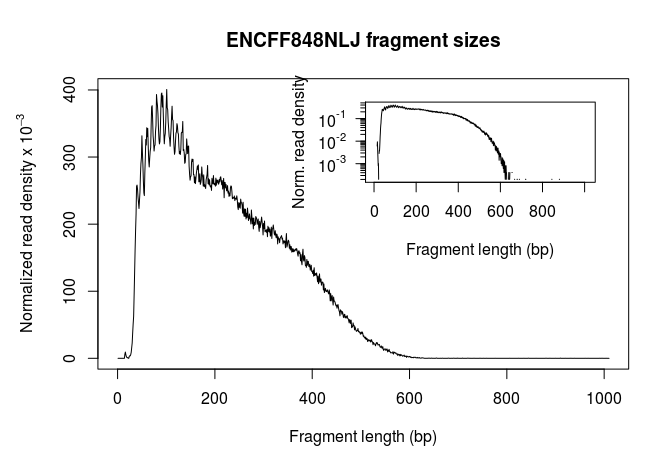
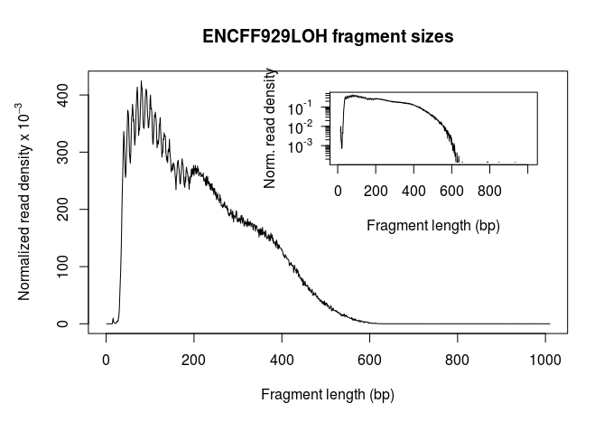

# ATACseq workshop

**Katarzyna Kedzierska**  
*September 16, 2017  
Jachranka, Poland*

## Table of Content
* [ATACseq workshop](#atacseq-workshop)
	* [Table of Content](#table-of-content)
	* [Plan](#plan)
    * [Data](#data)
    * [Before we start](#before-we-start)
    * [Quality metrics](#quality-metrics)
    * [Reads shifting](#reads-shifting)
    * [Peak calling](#peak-calling)
    * [Consensus peakset](#consensus-peakset)
    	* [Enrichr](#enrichr)
    * [Differential analysis](#differential-analysis)
    * [Footprinting](#footprinting)

## Plan

1) Quality metrics, fragment size distribution and reads shifting with R package ATACseqQC.
2) Calling peaks with MACS2 
3) Creating consensus peakset with bedtools 
4) Motif search with HOMER 
5) Footprinting with R package ATACseqQC

## Data 

We will be working on data from the Enocde project. It'll be embryonic liver in 0 and 12.5 days post fertilization. This can gives insights into chromatin dynamics in mouse development.

> Systematic mapping of chromatin state landscapes during mouse development
David Gorkin, Iros Barozzi, Yanxiao Zhang, Ah Young Lee, Bin Lee, Yuan Zhao, Andre Wildberg, Bo Ding, Bo Zhang, Mengchi Wang, J. Seth Strattan, Jean M. Davidson, Yunjiang Qiu, Veena Afzal, Jennifer A. Akiyama, Ingrid Plajzer-Frick, Catherine S. Pickle, Momoe Kato, Tyler H. Garvin, Quan T. Pham, Anne N. Harrington, Brandon J. Mannion, Elizabeth A. Lee, Yoko Fukuda-Yuzawa, Yupeng He, Sebastian Preissl, Sora Chee, Brian A. Williams, Diane Trout, Henry Amrhein, Hongbo Yang, J. Michael Cherry, Yin Shen, Joseph R. Ecker, Wei Wang, Diane E. Dickel, Axel Visel, Len A. Pennacchio, Bing Ren
bioRxiv 166652; doi: https://doi.org/10.1101/166652

I downloaded the small piece data from Encode servers:

accession number | days | tissue | replicate
---------------- | ----------- | ------ | ---------
ENCFF109LQF | 12.5 | liver | 2
ENCFF146ZCO | 12.5 | liver | 1
ENCFF848NLJ | 0 | liver | 2
ENCFF929LOH | 0 | liver | 1

The reads were processed and aligned according to he following pipeline (paired end).

[Kundaje lab ATAC-seq pipeline specifications - updated July 11th 2017](./ATACSeqPipeline.pdf)

I prepared the data for this workshop by executing following script. 

```bash
while read line; do 
	access_number=$(echo $line | cut -f1 -d' '); 
	echo ${access_number}; 
	bash workshopPreparation.sh -a ${access_number} -o mouse --directory ./mouse --threads 16 -c -p 0.02;
done < sampleSheet.csv 2>&1 | tee workshopPreparation.log
```

## Before we start

We need to do two things - one, copy bam files and two, check if every package in R is already installed. 

```
rsync -avz --exclude="*.git/" USERNAME@192.168.1.111:/ngschool/2017/ATACseq_workshop ~/ngschool/ATACseq_workshop

perl /home/USERNAME/miniconda2/share/homer-4.9.1-5/configureHomer.pl -install mm10

```
Open R and run the following code. 

```R

source("./scripts/test.R")

```

## Quality metrics

```R
require(ATACseqQC)
require(grid)
sampleSheet <- read.csv("sampleSheet_up.csv", 
                        sep ="\t", 
                        header = FALSE,
                        stringsAsFactors = FALSE)
bamfiles <- sampleSheet$V6
bamfiles.labels <- as.character(mapply(FUN=gsub, basename(bamfiles), MoreArgs = list(pattern = "_part.bam", replacement = "")))

#fragSize <- fragSizeDist(bamfiles, bamfiles.labels)
for (a in 1:length(bamfiles)) {
  grid.newpage()
  fragSize <- fragSizeDist(bamfiles[a], bamfiles.labels[a])
}
```

Fragment size distribution plot.




## Reads shifting

That was already done, don't run it since it requires huge package I don't think everyboy has. 

```R
require(BSgenome.Mmusculus.UCSC.mm10) #600 MB
## bamfile tags
tags <- c("AS", "XN", "XM", "XO", "XG", "NM", "MD", "YS", "YT")
## files will be output into outPath
outPath <- "shifted"
dir.create(outPath)

for (f in 1:length(bamfiles)) {
  gal <- readBamFile(bamfiles[f], tag=tags, asMates=TRUE)
  gal1 <- shiftGAlignmentsList(gal)
  shiftedBamfiles <- file.path(outPath, basename(bamfiles[f]))
  export(gal1, shiftedBamfiles)
}

```

## Peak calling

This is the command that will run the script for peak calling with our options specified. The code in this script can be found below.

```bash

bash ./scripts/peakCalling.sh

```

```bash
mkdir -p ./peaks
mkdir -p ./motifs
while read line; do
        accession_number=$(echo $line | cut -f1 -d' ');
        shiftedBamFile=$(echo $line | cut -f6 -d' ');
        macs2 callpeak \
                --verbose 3 \
                --treatment ${shiftedBamFile} \
                -g mm \
                -B \
                -q 0.05 \
                --extsize 200 \
                --nomodel \
                --shift -100 \
                --nolambda \
                --keep-dup all \
                -f BAM \
                --outdir ./peaks/${accesssion_number} \
                --call-summits
        cat ./peaks/${accesssion_number}/NA_peaks.narrowPeak | cut -f1-3 > ./peaks/${accesion_number}.bed
        bedtools intersect -abam ${shiftedBamFile} -b ./peaks/${accession_number}.bed -bed > ./peaks/${accesssion_number}_frip.bed
        findMotifsGenome.pl ./peaks/${accesion_number}.bed mm10 ./motifs/${accession_number} -size 200 -p 16 -S 15 -len 8
done < sampleSheet_up.csv
```

FRiP

```
   964784 ENCFF109LQF_frip.bed
  1344882 ENCFF146ZCO_frip.bed
   717487 ENCFF848NLJ_frip.bed
   999222 ENCFF929LOH_frip.bed


```

```R
require(ChIPseeker)
require(rtracklayer)
require(TxDb.Mmusculus.UCSC.mm10.knownGene)
txdb <- TxDb.Mmusculus.UCSC.mm10.knownGene

# To import narrowPeak files
extraCols_narrowPeak <- c(signalValue = "numeric", pValue = "numeric",
                          qValue = "numeric", peak = "integer")

peakFiles <- list.files(pattern = "[A-Z0-9].bed", path = "./peaks", full.names = TRUE)
peakGRs <- lapply(peakFiles, import, format = "BED")

peakAnnoList <- lapply(peakGRs, annotatePeak, TxDb=txdb, tssRegion=c(-3000, 3000), verbose=FALSE)
names(peakAnnoList) <- basename(peakFiles)
ll
plotAnnoBar(peakAnnoList)
plotDistToTSS(peakAnnoList)

```

## Consensus peakset

```bash

bash ./scripts/consensus.sh

```

```bash

bedtools intersect -wa -wb -f 0.5 -r -a ./peaks/ENCFF109LQF.bed -b ./peaks/ENCFF146ZCO.bed | sort -k1,1 -k2,2n | bedtools merge > ./peaks/embryoLiver_12.5.bed
bedtools intersect -wa -wb -f 0.5 -r -a ./peaks/ENCFF848NLJ.bed -b ./peaks/ENCFF929LOH.bed | sort -k1,1 -k2,2n | bedtools merge > ./peaks/embryoLiver_0.bed
wc -l ./peaks/*.bed

```

### Enrichr

Use the bed files to run Enrichr on 2k closest genes.

[embryoLiver_12.5days](http://amp.pharm.mssm.edu/Enrichr/enrich?dataset=2onpx)
[embryoLiver_0days](http://amp.pharm.mssm.edu/Enrichr/enrich?dataset=2onpw)

## Differential analysis

```R
require(DiffBind)
exp <- dba(sampleSheet = "./sampleSheetDB.csv")
plot(exp)
dba.ap(exp, mode=DBA_OLAP_RATE)
exp <- dba.count(exp)
exp <- dba.contrast(exp, minMembers=2)
exp <- dba.analyze(exp)
plot(exp)
dba.plotPCA(exp, DBA_FACTOR, label=DBA_TISSUE)
saveRDS(object = exp, file = "exp.rds")
dba.plotMA(exp)

```

## Footprinting

We are going to substitute CTCF for another one.

```R

require(MotifDb)
require(ATACseqQC)
require(BSgenome.Mmusculus.UCSC.mm10)
CTCF <- query(MotifDb, c("CTCF"))
CTCF <- as.list(CTCF)
print(CTCF[[1]], digits=2)

genome <- Mmusculus

factorFootprints(bamfiles[1], pfm=CTCF[[1]], 
                 genome=genome,
                 min.score="95%",
                 upstream=100, downstream=100)

```